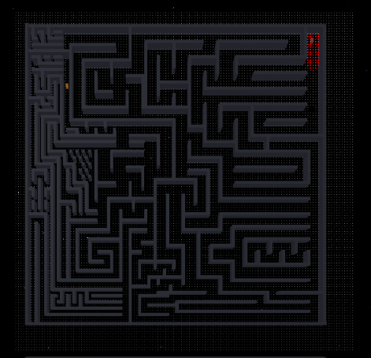

<div align="center">
  
</div>

# 🧠 Custom Pathfinding System (CPS) - R&D Archives
> **Role:** Algorithm Engineer & Solo Developer  
> **Platform:** Roblox (Luau)  
> **Focus:** Graph Theory, A* Algorithms, Raycasting, Optimization.  
> **Status:** Archived (Research Project)

## 📖 The Story Behind The Code
This project started with a simple ambition 2 years ago: **"Make a tank AI that hunts the player."** When Roblox's built-in `PathfindingService` failed to handle the complex vehicle hitboxes, I decided to build my own navigation engine from scratch. 

What followed was a deep dive into Computer Science fundamentals, evolving through **3 distinct phases** of failure, learning, and breakthrough.

---

## 🧬 Phase 1: The "Greedy" Mistake (v1.0 - v2.0)

<div align="center">
  
  <p><em>The Origin: Tank AI attempting to navigate complex geometry.</em></p>
</div>
<br>

* **Goal:** Make the unit move directly to the target.
* **Algorithm:** Greedy Best-First Search.
* **The Fail:** The unit would get stuck behind U-shaped walls. It constantly tried to minimize distance to the target, meaning it refused to move *away* (backwards) to navigate around obstacles.
* **Lesson Learned:** "Shortest distance" is not always the "correct direction." Local extrema traps are real.
* 📄 *Source Code:* `Finder.txt`, `Finder2.0.txt`

---

## 🔬 Phase 2: Visualizing the Logic (v4.0 - v6.0)

<div align="center">
  
  
  <p><em>Left: RGB Heatmap Propagation | Right: Node Scanning System</em></p>
</div>
<br>

* **Goal:** Solve the maze using a "Flood Fill" (Wavefront) approach.
* **The Breakthrough:** I implemented a node-based propagation system. The algorithm expands like water, assigning distance values to every reachable node. 
* **Visual Debugging:** I created a real-time **Heatmap System** using RGB values. As the search wave expanded, the color shifted from Red to Blue, allowing me to *see* the algorithm "thinking."
* **Result:** 100% Accuracy in complex mazes.
* **The Problem:** It was **slow**. Finding a path took 3-10 seconds. Unacceptable for combat gameplay.
* 📄 *Source Code:* `Finder4.0.txt`, `Finder6.0.txt`


---

## ⚡ Phase 3: The Architecture of Speed (Delta Series)
* **Goal:** Reduce latency from 3s to <0.1s (Real-time).
* **Optimization Strategy:** 1.  **Modular Architecture:** Refactored spaghetti code into a clean, modular structure (`DPathfindingUltra` folder with `Pointer`, `Ray`, `UltimatePF` modules).
    2.  **Loop Unrolling:** In `UltimatePF4`, I manually calculated 24 directional vectors to bypass the overhead of `for` loops in Luau.
* **The "Delta" Experiments:** Iterated through 10 versions (`Delta1` - `Delta10`) pushing the engine to its limits.
* **Final Verdict:** The system became incredibly fast but brittle (unstable). While `Delta10` achieved the architectural goals, the complexity made debugging difficult.

> **Code Highlight (`UltimatePF4.lua`):** > *Aggressive optimization: Manually checking 24 neighbors to save milliseconds.*
```lua
-- Manual expansion of search nodes to reduce iteration cost
local pottential_point01,point01  = v + Vector3.new(0,0,point_distance), true
local pottential_point02,point02  = v + Vector3.new(0,0,-point_distance),true
-- ... (Checking 24 surrounding vectors simultaneously) ...
if point01 == true and point09 == true and point17 == true then 
    table.insert(new_segment,i,pottential_point17) 
end

```

---

## 🚩 Retrospective

This repository is not just a tool; it's a documentation of my growth as an engineer.

1. **Visual Debugging is Key:** You cannot fix what you cannot see. The RGB heatmap was my most valuable tool.
2. **Premature Optimization:** In Phase 3, I sacrificed readability for speed, which eventually killed the project's maintainability.
3. **Math > Code:** Writing the code is easy; understanding the vector mathematics and graph theory behind it is the real challenge.

---

### 📂 Repository Structure

* `/Phase1_Greedy` - Early experiments (`Finder.txt`).
* `/Phase2_Visuals` - The working heatmap algorithms (`Finder4.0`, `Finder6.0`).
* `/Phase3_Speed` - The modular, optimized architecture (`UltimatePF4`, `Delta10`).
* `/Assets` - Thumbnails and screenshots.

